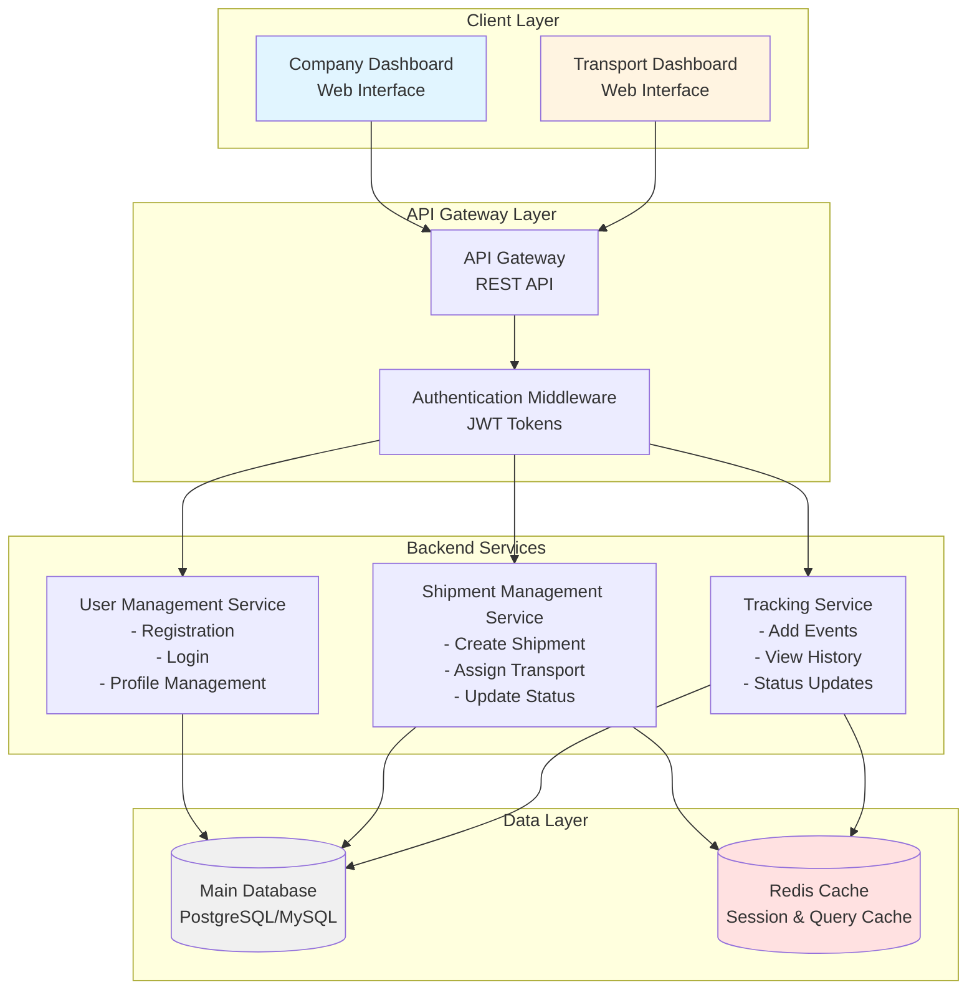

```mermaid
graph TB
    subgraph "Client Layer"
        CompanyUI[Company Dashboard<br/>Web Interface]
        TransportUI[Transport Dashboard<br/>Web Interface]
    end

    subgraph "API Gateway Layer"
        Gateway[API Gateway<br/>REST API]
        Auth[Authentication Middleware<br/>JWT Tokens]
    end

    subgraph "Backend Services"
        UserService[User Management Service<br/>- Registration<br/>- Login<br/>- Profile Management]
        ShipmentService[Shipment Management Service<br/>- Create Shipment<br/>- Assign Transport<br/>- Update Status]
        TrackingService[Tracking Service<br/>- Add Events<br/>- View History<br/>- Status Updates]
    end

    subgraph "Data Layer"
        MainDB[(Main Database<br/>PostgreSQL/MySQL)]
        Cache[(Redis Cache<br/>Session & Query Cache)]
    end

    CompanyUI --> Gateway
    TransportUI --> Gateway

    Gateway --> Auth
    Auth --> UserService
    Auth --> ShipmentService
    Auth --> TrackingService

    UserService --> MainDB
    ShipmentService --> MainDB
    TrackingService --> MainDB

    ShipmentService --> Cache
    TrackingService --> Cache

    style CompanyUI fill:#e1f5ff
    style TransportUI fill:#fff4e1
    style MainDB fill:#f0f0f0
    style Cache fill:#ffe1e1
```
